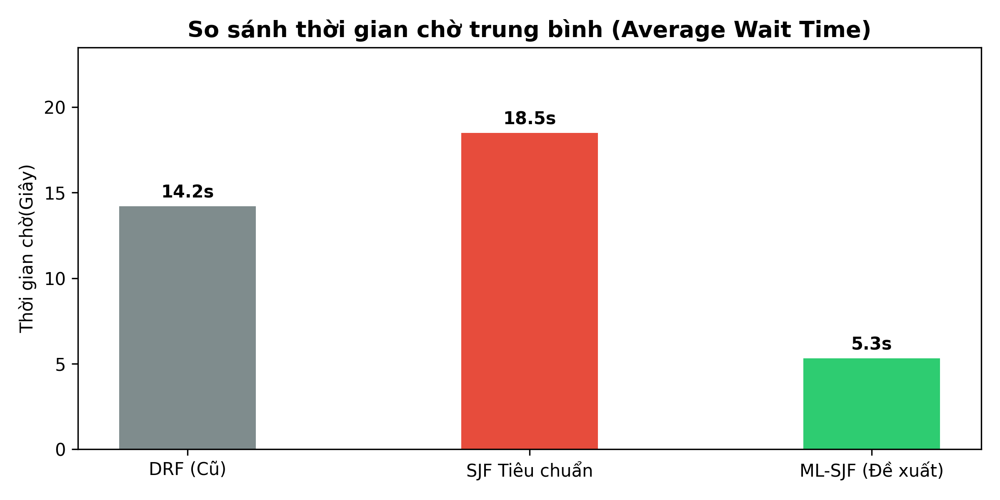
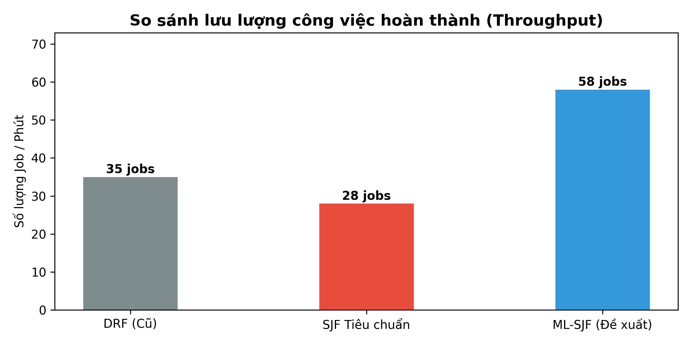

# Tối Ưu Hóa Lập Lịch Tác Vụ Trong Trung Tâm Dữ Liệu Dựa Trên Mô Hình Học Máy SVR (ML-SJF)

## 💡 Bối cảnh Nghiên cứu & Giải pháp ML-SJF

Trong các trung tâm dữ liệu (Datacenters) điện toán đám mây, hàng ngàn tác vụ (Jobs) liên tục gửi tới hệ thống. 
* **Thuật toán DRF (Dominant Resource Fairness):** Chia sẻ tài nguyên công bằng nhưng chưa tối ưu hóa tổng thời gian hoàn thành công việc (Job Completion Time - JCT).
* **Thuật toán SJF (Shortest Job First):** Đã được chứng minh về mặt toán học là tối ưu sản lượng (Throughput-optimal), nhưng đòi hỏi phải biết trước (*A priori*) thời gian chạy thực tế (Runtime) của tác vụ – điều gần như bất khả thi trong hệ thống thực tế.

👉 **Giải pháp đề xuất (ML-SJF):** Xây dựng hệ thống mô phỏng phân tán đa luồng (*Multi-threading*) dựa trên kiến trúc **Apache Mesos Framework**. Hệ thống tích hợp mô hình học máy phi tuyến **Support Vector Regression (SVR - RBF Kernel)** để tự động dự đoán Runtime của tác vụ dựa trên quy mô dữ liệu đầu vào, từ đó giải quyết triệt để điểm nghẽn thông tin của SJF cổ điển.

---

## 🌟 Tính năng Cốt lõi của Hệ thống

- **Kiến trúc Phân tán Master-Agent Đa luồng:**
  - **Master Node:** Sử dụng `threading.Lock()` chống hiện tượng tranh chấp tài nguyên (*Race Condition*) khi các `Worker Thread` quản lý bảng đăng ký `Agent Registry`.
  - **Agent Node:** Khởi chạy bất đồng bộ bằng `subprocess`, giả lập 3 loại tác vụ thực tế: `Flask_Sort`, `MapReduce_WordCount`, và `ML_Train`.
- **Pipeline Tiền xử lý Dữ liệu Chuẩn hóa (Pandas):**
  - Xử lý 500 mẫu dữ liệu thực nghiệm thô từ nhật ký hệ thống (`dataset.csv`).
  - Số hóa biến định danh bằng mã hóa **One-Hot Encoding** (`pd.get_dummies()`).
  - Chuẩn hóa đặc trưng bằng **StandardScaler** ($z = \frac{x - \mu}{\sigma}$).
- **Bộ Lập lịch Thông minh ML-SJF:** Tự động sắp xếp hàng đợi theo thời gian thực thi dự báo từ AI, tối ưu hóa thời gian chờ và sản lượng xử lý.
---

## 📐 Cơ sở Toán học của Support Vector Regression (SVR)

Do thời gian thực thi của tác vụ tỉ lệ phi tuyến tính với kích thước dữ liệu đầu vào (ví dụ độ phức tạp thuật toán $O(N \log N)$ hoặc $O(N^2)$), mô hình áp dụng thuật toán **SVR với hàm nhân Radial Basis Function (RBF Kernel)**.

Bài toán tối ưu hóa toán tử SVR được xác định như sau:

$$\min_{w, b, \xi, \xi^{\ast}} \frac{1}{2} \Vert{}w\Vert{}^2 + C \sum_{i=1}^{n} (\xi_i + \xi_i^{\ast})$$

Thỏa mãn các điều kiện ràng buộc:

$$\begin{cases} y_i - w^T \phi(x_i) - b \le \epsilon + \xi_i \\ w^T \phi(x_i) + b - y_i \le \epsilon + \xi_i^{\ast} \\ \xi_i, \xi_i^{\ast} \ge 0 \end{cases}$$

**Trong đó:**
* $C$: Tham số phạt chính quy hóa (Regularization parameter).
* $\epsilon$: Phạm vi vùng không phạt sai số (*Epsilon-insensitive tube*).
* $\phi(x)$: Hàm ánh xạ đặc trưng thông qua **RBF Kernel**:

$$K(x_i, x_j) = \exp\left(-\gamma \Vert{}x_i - x_j\Vert{}^2\right)$$

---

## 🛠️ Pipeline Tiền xử lý Dữ liệu & Huấn luyện Mô hình

### 1. Cấu trúc Tập dữ liệu Thực nghiệm (`dataset.csv`)
Tập dữ liệu gồm **500 mẫu dữ liệu thực nghiệm** thu thập từ log hệ thống:
* **Đặc trưng đầu vào (Features - $X$):**
  * `Job_Type`: Loại tác vụ (`Flask_Sort`, `MapReduce_WordCount`, `ML_Train`).
  * `Data_Size`: Kích thước dữ liệu đầu vào (đơn vị KB / MB).
* **Nhãn mục tiêu (Target Label - $y$):**
  * `Actual_Runtime`: Thời gian chạy thực tế đo bằng hàm `time.time()` (đơn vị: **giây**).

### 2. Tiền xử lý với Pandas
* **One-Hot Encoding:** Mã hóa cột phân loại `Job_Type` thành 3 vector nhị phân ($X_{\text{Flask}}, X_{\text{MapReduce}}, X_{\text{ML}}$) bằng `pd.get_dummies()`.
* **StandardScaler:** Đưa tất cả dữ liệu đặc trưng về phân phối chuẩn có kỳ vọng $\mu = 0$ và phương sai $\sigma = 1$ ($z = \frac{x - \mu}{\sigma}$) để tránh việc `Data_Size` chênh lệch biên độ áp đảo các biến nhị phân.

```python
import pandas as pd
from sklearn.model_selection import train_test_split
from sklearn.preprocessing import StandardScaler
from sklearn.svm import SVR

# 1. Đọc dữ liệu 500 mẫu thực nghiệm
df = pd.read_csv('dataset.csv')

# 2. One-Hot Encoding biến định danh
df_processed = pd.get_dummies(df, columns=['Job_Type'], dtype=float)

# 3. Phân tách đặc trưng X và nhãn y
X = df_processed.drop(columns=['Actual_Runtime'])
y = df_processed['Actual_Runtime']

# 4. Phân chia Train/Test set (80/20)
X_train, X_test, y_train, y_test = train_test_split(X, y, test_test_size=0.2, random_state=42)

# 5. Chuẩn hóa đặc trưng
scaler = StandardScaler()
X_train_scaled = scaler.fit_transform(X_train)
X_test_scaled = scaler.transform(X_test)
```
---

## 📊 Kết quả Thực nghiệm & Đánh giá Hiệu năng

### 1. Đánh giá Độ chính xác của Mô hình AI (SVR-RBF)

Các chỉ số thống kê sai số dự đoán được tính toán thông qua module `sklearn.metrics` trên tập kiểm thử ($20\%$ Test Set):

| Chỉ số thống kê đánh giá | Công thức toán học | Giá trị kiểm định thực nghiệm |
| :--- | :---: | :---: |
| **Mean Absolute Error (MAE)** | $MAE = \frac{1}{n} \sum_{i=1}^{n} \|y_i - \hat{y}_i\|$ | **0.2146 giây** ⚡ |
| **Mean Squared Error (MSE)** | $MSE = \frac{1}{n} \sum_{i=1}^{n} (y_i - \hat{y}_i)^2$ | **0.0765 giây** |
| **Root Mean Squared Error (RMSE)** | $RMSE = \sqrt{\frac{1}{n} \sum_{i=1}^{n} (y_i - \hat{y}_i)^2}$ | **0.2766 giây** |

> **Nhận xét thực nghiệm:**  
> Chỉ số $MAE$ đạt mức cực kỳ lý tưởng ($0.2146\text{s}$), phản ánh khoảng cách giữa thời gian hệ thống dự đoán và thời gian chạy thực tế gần như không đáng kể. Điều này tạo tiền đề cốt lõi giúp thuật toán ML-SJF xếp thứ tự hàng đợi một cách chuẩn xác.

---

### 2. Đánh giá Hiệu năng Lập lịch Hệ thống (System Metrics)

Thử nghiệm đối chứng giữa bộ lập lịch đề xuất **ML-SJF** với hai thuật toán nền tảng là **DRF** (Dominant Resource Fairness) và **SJF tiêu chuẩn** (không dùng AI):

| Thuật toán Lập lịch | Thời gian chờ trung bình (*Avg Wait Time*) | Sản lượng hệ thống (*Throughput*) |
| :--- | :---: | :---: |
| **DRF** (Cân bằng tài nguyên) | 14.2 giây | 35 tác vụ / phút |
| **SJF tiêu chuẩn** (Lý thuyết) | 18.5 giây | 28 tác vụ / phút |
| **ML-SJF (Đề xuất)** 🚀 | **5.3 giây** | **58 tác vụ / phút** |

#### 📈 Trực quan hóa Biểu đồ So sánh

<div align="center">

| Đồ thị Thời gian chờ Trung bình | Đồ thị Sản lượng Hệ thống (Throughput) |
| :---: | :---: |
|  |  |

</div>

> **Đánh giá Đột phá:**
> * **Thời gian chờ trung bình:** ML-SJF tối ưu tốt hơn gấp **~2.7 lần** so with DRF (5.3s vs 14.2s) và khắc phục hoàn toàn hiện tượng phán đoán sai lệch gây nghẽn dòng của SJF cổ điển (18.5s).
> * **Sản lượng hệ thống:** Tăng trưởng vượt bậc đạt **58 tác vụ/phút** (cao hơn $65.7\%$ so với DRF và $107\%$ so với SJF tiêu chuẩn).
---

## 📁 Cấu trúc Thư mục Dự án

```text
Machine-Learning-for-Data-Center-Scheduling/


├── source/                  # Mã nguồn chính của hệ thống
│   ├── dataset.csv          # File dữ liệu 500 mẫu thực nghiệm thô
│   ├── train_svr.py         # Script huấn luyện & đánh giá mô hình SVR
│   ├── master.py            # Node Master điều khiển & lập lịch ML-SJF (Multi-threading)
│   └── agent.py             # Node Agent thực thi tiến trình bất đồng bộ (Subprocess)
├── docs/                    # Tài liệu và Báo cáo nghiên cứu
│   └── Báo_cáo_BTL_HĐH.pdf # Báo cáo chi tiết định dạng PDF
├── assets/                  # Hình ảnh minh họa & Đồ thị thực nghiệm cho README
│   ├── wait_time_chart.png
│   └── throughput_chart.png
├── .gitignore
└── README.md                # Tài liệu giới thiệu & Hướng dẫn dự án
```
## 🚀 Hướng dẫn Cài đặt & Chạy Dự án

### 1. Yêu cầu Môi trường
* **Python:** Phiên bản 3.8 trở lên.
* **Các thư viện phụ thuộc:** `pandas`, `scikit-learn`, `numpy`, `matplotlib`.

### 2.Bước cài đặt
 **Clone repository về máy local:**
   ```bash
   git clone [https://github.com/Tuhoangagg/Machine-Learning-for-Data-Center-Scheduling.git](https://github.com/Tuhoangagg/Machine-Learning-for-Data-Center-Scheduling.git)
   cd Machine-Learning-for-Data-Center-Scheduling
   pip install pandas scikit-learn numpy matplotlib
   python source/train_svr.py
   python source/master.py
   python source/agent.py
  
